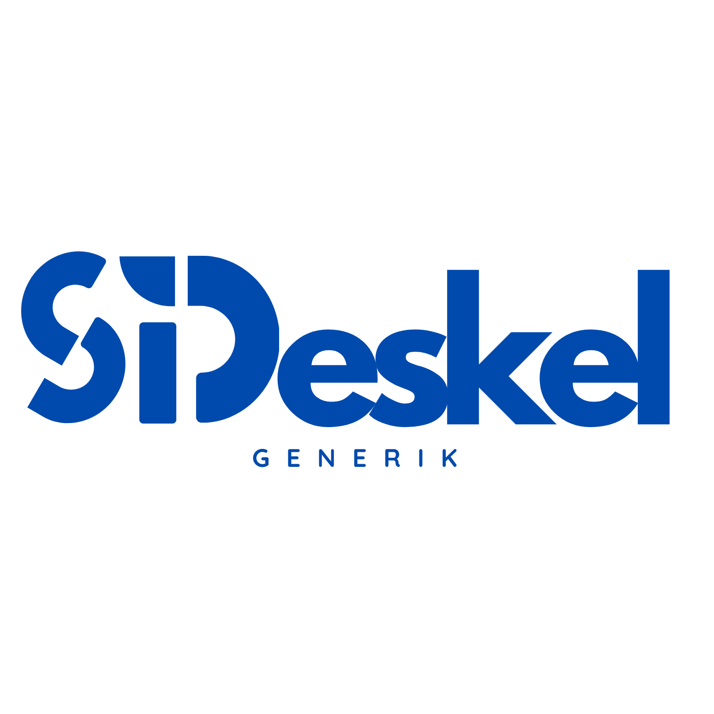

<p align="center"><a href="#" target="_blank"></a></p>

<p align="center">
<a href="https://github.com/laravel/framework/actions"></a>
<a href="https://packagist.org/packages/laravel/framework"></a>
<a href="https://packagist.org/packages/laravel/framework"></a>
<a href="https://packagist.org/packages/laravel/framework"></a>
</p>

# SIDeskel Generik

## Keterangan Aplikasi
SIDeskel Generik adalah Sistem Informasi Desa/Kelurahan yang dibangun secara open-source agar dapat bebas digunakan dan dikembangkan oleh desa/kelurahan manapun. Aplikasi ini dirancang untuk mengelola data desa/kelurahan dan memfasilitasi proses pembaruan data yang melibatkan banyak pihak. Selain itu, SIDeskel Generik juga ditujukan agar desa/kelurahan dapat menyediakan informasi yang dapat diakses oleh masyarakat luas.

## Fitur
- **Pengelolaan Data Desa/Kelurahan:** Mengelola data umum desa/kelurahan seperti data penduduk, wilayah, dan administrasi.
- **Pembaruan Data:** Memfasilitasi proses pembaruan data yang melibatkan banyak pihak.
- **Akses Informasi Publik:** Menyediakan informasi yang dapat diakses oleh masyarakat luas.
  
## Langkah Penggunaan

1. **Install dependencies PHP:**
    ```bash
    composer install
    ```

2. **Install dependencies Node.js:**
    ```bash
    npm install
    npm install vite
    ```

3. **Build assets:**
    ```bash
    npm run build
    ```

4. **Link storage:**
    ```bash
    php artisan storage:link
    ```

5. **Cache icons:**
    ```bash
    php artisan icon:cache
    ```

6. **Cache routes:**
    ```bash
    php artisan route:cache
    ```

## Lisensi
SIDeskel Generik adalah proyek open-source yang dilisensikan di bawah lisensi [MIT](LICENSE).

## Kontribusi
Kontribusi terbuka untuk siapa saja. Silakan buat pull request untuk mengusulkan perubahan atau perbaikan.

## Kontak
Jika Anda memiliki pertanyaan atau membutuhkan bantuan, silakan hubungi kami melalui email: support@sideskel.com
